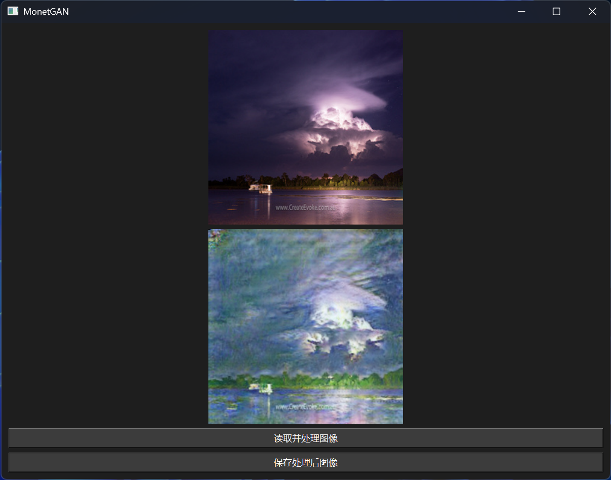
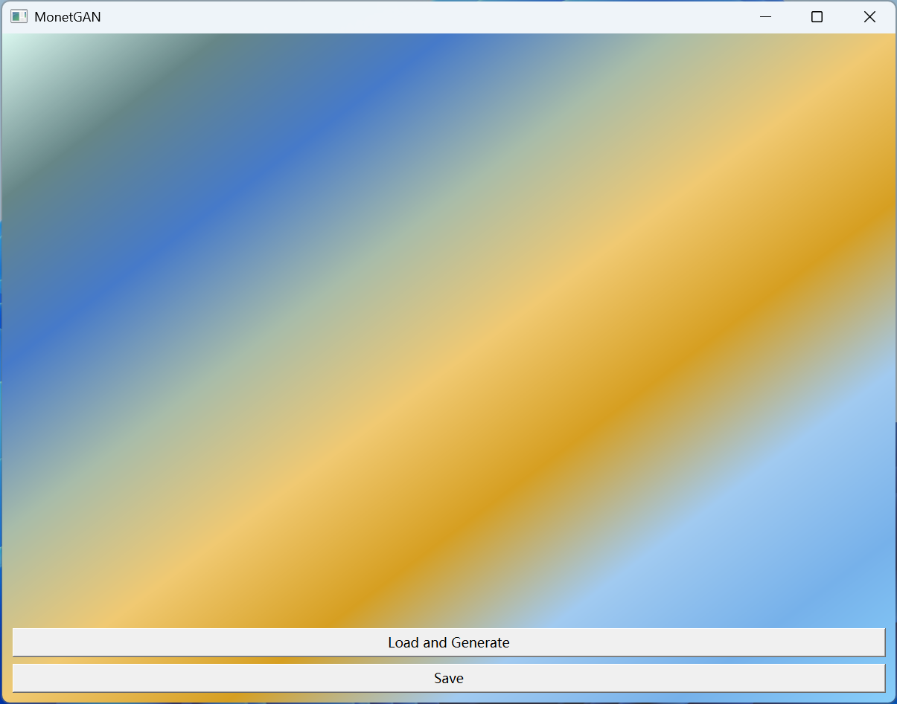

# MonetGAN
A lightweight app transferring your photos to Monet-styled images

Based on CycleGAN 
https://github.com/junyanz/pytorch-CycleGAN-and-pix2pix

Constructed in Pytorch (as the AI backend) and C++-Qt (as the UI frontend)

Deployed using LibTorch as AI frontend for inference

Hi, I'm Sidney Lu, now a freshman of Nankai University (NKU), China. This is my final project for the course "Advanced Programming in C++" (COSC0039).

If you like it, please give me your precious star, or you just thought it could be better, please share your feedback with me. 

As a complete green-hand in programming, I believe any of your comments can engrace my learning.

Feel free to email me at 3151599052@qq.com or sidneylu0822@mail.nankai.edu.cn !

## Environment and Dependencies
* Windows 11
* Python 3.13.2
* CUDA 12.6 with CuDNN
* PyTorch 2.6.0
* MSVC Compiler (Visual Studio 2022)
* CMake 4.0.0
* Qt 6.8.2
* OpenCV 4.11.0
* LibTorch 2.6.0

## Logs

### Log ver 0.0.1
Hello World!

### Log ver 0.1.0
Initiated Generator model and converted to TorchScript
My model is trained on _monet2photo_ dataset, which is created by contributors from UC Berkeley.
http://efrosgans.eecs.berkeley.edu/cyclegan/datasets/monet2photo.zip

The art images were downloaded from Wikiart.

I have done some modifications to the model, such as only reserving GeneratorBtoA (from photos to Monet images) in the release version.

My next step is to load it via LibTorch.

### Log ver 0.2.0
LibTorch model successfully loaded, ready to be packaged.

You may have to make some changes on CMakeLists.txt so you can run it locally.

Please Change ```CMAKE_PREFIX_PATH``` and ```QT_INSTALL_PATH``` to corresponding directories on your on devices.

For this test version, you need to put your "input.jpg" and the .pt file in the same path of built .exe. 

For your convenience, loading the project and building it using CLion is recommended.

Starting to furnish Qt GUI

### Log ver 0.3.0
The generator has been encapsulated into a function

### Log ver 0.4.0
Establishing a simple UI

Two Buttons interacting with filesystem left to be constructed

Visualizing original and generated images will be implemented in subsequent versions

### Log ver 0.5.0
UI is ready!

Try it!


### Log ver 0.6.0
Optimizing UI

Adding QSS


## Citations
```
@inproceedings{CycleGAN2017,
  title={Unpaired Image-to-Image Translation using Cycle-Consistent Adversarial Networks},
  author={Zhu, Jun-Yan and Park, Taesung and Isola, Phillip and Efros, Alexei A},
  booktitle={Computer Vision (ICCV), 2017 IEEE International Conference on},
  year={2017}
}
```

## Acknowledgements
Thanks to Ziheng Ouyang for his technique support (some ingenious debugging ideas on LibTorch model loading).
https://github.com/ouyangziheng